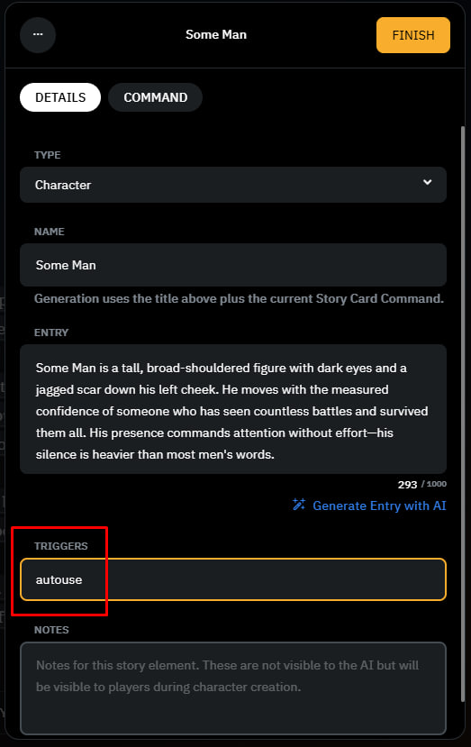
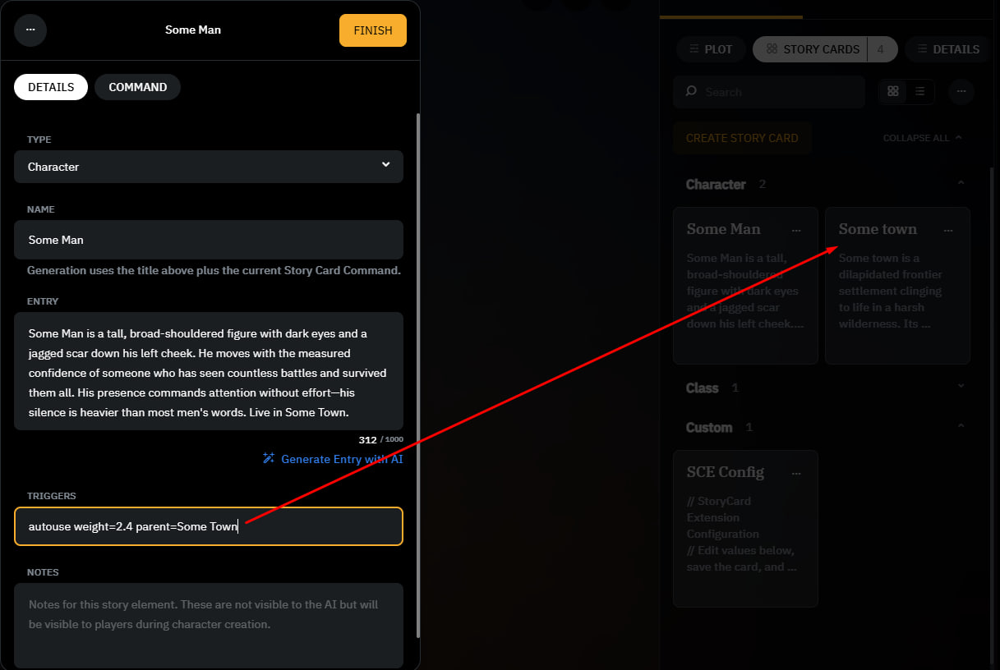
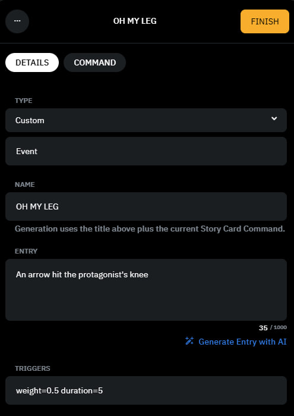

# What will be written here?
- Installing a script if you've never used scripts in AID before
- Combining multiple scripts using Inner Self as an example
- Customizing SCE to your needs
Remember, these are detailed instructions that should cover all your questions, which is why they're so long.
Don't be intimidated by them; everything is much simpler than it seems.

## 1. Step‑by‑Step Installation

1. Open your scenario in **AI Dungeon**.
2. Click **Edit Scenario**.
3. Open the **DETAILS** tab.
4. Scroll down to the **Scripting** section.
5. Enable the option **Scripts Enabled**.
6. Click **EDIT SCRIPTS**.

You will see several script files in the editor:

- **Library**
- **Input**
- **Context**
- **Output**

For each of these files, do the following:

1. Open the corresponding script file from this repository.
2. Copy its contents.
3. Paste the contents into the matching editor file in AI Dungeon.

Example:

- Copy the contents of `Library.js` → paste into **Library**
- Copy the contents of `Input.js` → paste into **Input**
- Copy the contents of `Context.js` → paste into **Context**
- Copy the contents of `Output.js` → paste into **Output**

After inserting the contents of all files, click the **Save** button located in the **top‑right corner** of the script editor.

Once saved, the script will be active and you can immediately start your adventure.

## Combining scripts with SCE

All you need to do is copy and paste text in two places — Ctrl+C and Ctrl+V. Even a child can do this, no need to worry or be afraid.

Briefly:
If there are no other scripts in **Library**, simply add `Library.js` to **Library**.
If there are other scripts in **Library**, just add my `Library.js` either at the very beginning of **Library** or at the very end — it doesn't matter.
And add `text = StoryCardExtensionContext(text);` to **Context** between `const modifier = (text) => {` and `return { text };`.

If you still don't understand, below are many other explanations for you.
If you don't understand any of them, send these explanations to an AI like DeepSeek and it will tell you how to do it.

For my script to work with something else, only two small steps are needed:

1. All the text inside `Library.js` must be inside **Library**.
Simply put: just Ctrl+V this script at the beginning or end of **Library**. That's it. Nothing complicated.
If even that is unclear, here's a detailed example.
First option: first install my script, then instead of "//Other code here" at the beginning or end, paste the Library of another script. That is, replace the first or last line where "//Other code here" is written with the other script.
Second option: first install my script, then at the very beginning or very end of the file, add everything that is in the `Library.js` file.

2. In **Context**, you must have `text = StoryCardExtensionContext(text);` written between `const modifier = (text) => {` and `return { text };`, as shown below:
```js
const modifier = (text) => {
    text = StoryCardExtensionContext(text); //must be before "return {" and after "const modifier = (text) => {"
    return { text };
};
modifier(text);
```

If both steps are followed, the script should work with any other script — it’s self‑contained and shouldn’t break other scripts.

Using Inner Self as an example:  
In the `Library.js` file of the Inner Self script, it says: "// Your "Library" tab should look like this" — just copy all its code and paste it into **Library** exactly as in its installation instructions.  
Then take a closer look: at the very end of the file you pasted from Inner Self’s `Library.js`, there is the line "// Your other library scripts go here". SCE is exactly that "other library script". Simply copy `Library.js` from SCE and paste it instead of that line (or on the next line).  
You should end up with something like this:
```
// Your "Library" tab should look like this

/**
 * Main control panel for scenario creator convenience
 * Settings defined here will override their counterparts elsewhere
 * Most AC and Inner Self settings are included
 * Safe to delete
 */
globalThis.MainSettings = (class MainSettings {

...................................................
............ Очень много текста скрипта Inner Self
...................................................

} function isolateLSIv2(code, log, text, stop) { const console = Object.freeze({log}); try { eval(code); return [null, text, stop]; } catch (error) { return [error, text, stop]; } }

// Your other library scripts go here
//This is where SCE is inserted. 

// ============================================================================
// StoryCard Extension
// ============================================================================

const CONFIG_CARD_TITLE = "SCE Config";
const DEFAULT_CONFIG = {
```
We simply added my script at the very end of the already installed Inner Self script by copying it. And half the work is already done.

Now the second half. We have Inner Self’s **Context.js**:
```
// Your "Context" tab should look like this
InnerSelf("context");
const modifier = (text) => {
  // Any other context modifier scripts can go here
  return { text, stop };
};
modifier(text);
```
All we need to do is add one line of my script:
```
// Your "Context" tab should look like this
InnerSelf("context");
const modifier = (text) => {
  // Any other context modifier scripts can go here
  text = StoryCardExtensionContext(text);
  return { text, stop };
};
modifier(text);
```
We inserted `text = StoryCardExtensionContext(text);`, and that is exactly the "Any other context modifier scripts can go here" that was mentioned.

Save it and congratulations — you now have Inner Self and SCE installed at the same time!
That wasn’t so hard, was it?

## SCE Configuration for your scenarios

When you paste `Library.js`, at the very top you can see the following:
```
const CONFIG_CARD_TITLE = "SCE Config";
const DEFAULT_CONFIG = {
    randomCardChance: 0.0,
    randomEventChance: 0.05,
    useOnlyAutouseCards: false,
    eventDuration: 2,
    useEventWeights: true,
    useCardWeights: true,
    currentEventTitle: "",
    currentEventDurationLeft: 0,
    alwaysIncludeCards: [],
    contextRecallEnabled: true,
    contextRecallThreshold: 0.05,
    contextWindowChars: 10000,
    contextRecallMaxCards: 5,
    customStopWords: [],
    recallInsertPosition: "bot",
    recallDecayRate: 0.995,
    cascadeEnabled: false,
    cascadePriorityMultiplier: 1.3
};
```
This is the SCE config — the one that appears as a "SCE Config" story card when the adventure starts. If you change something in this code, it will be changed in the card during gameplay for players. And it’s best to make changes here.  
To understand what each line does, I suggest you enter a scenario with SCE enabled and open that card. At the bottom of the card’s description, detailed explanations will be written.  
Here, I’ll focus on the most important part.

"useOnlyAutouseCards: false" — this is the most important thing you need to understand if you are making a scenario or want to use SCE properly.  
If set to `false`, all your cards — except cards with the word "Config" in their name and cards with Event type — will be used by the script. All of them, without exception.  
To control which cards the script uses yourself, set it to `true`. In that case, the script will only take into account cards that have `autouse` written in their Triggers.

Below is an example of where to write `autouse`:



If you don’t want to bother with it, set it to `false`. If you’re afraid that the AI will take into account cards it shouldn’t — such as story spoilers or information from other kingdoms/cities — set it to `true` and mark only the necessary cards that way.

The second most important thing is the Weight mechanic and the Parent mechanic. They are not directly related to each other, but both are equally simple and at the same time important for creating a good story.



If you write weight like this — the card will be more important to the script. For example, Recall will react to it more strongly.  
Weight = 2 means the script will treat any match as twice as important.  
If you set weight = 0 — the card will not be considered by the script.  
For all cards where weight is not written, it equals 1.

If you write parent like this — during Recall, the script will check whether there are recent context matches with the Parent. If there aren’t enough matches, the card is not added (this helps prevent characters from one city from appearing in another).  
Additionally, when a card is mentioned in the context, a whole hierarchy is built. The AI will see that the card with Parent is part of Parent. This instruction helps the AI understand what is happening, while remaining as universal as possible.  
You can use this not only for locations, but also, for example, for parts of a character’s personality, or character memories — no limits.

The third most important thing is alwaysIncludeCards.

It simply keeps the named story cards in the context at all times, so the AI doesn’t get lost. Along with this, World Info instructions are given, so the AI will not perceive this as something happening or a call to action — it will be reference information that it considers much more often than AN or PE.

When modifying the code, write it like this: `alwaysIncludeCards: ["Some man", "Some Town"]`
Within the SCE Config Card during gameplay, write it like this: `alwaysIncludeCards = Some man, Some Town`

customStopWords — something similar. In exactly the same way as with alwaysIncludeCards, you write words that will not be taken into account by Recall.

And the last thing that might be important: Events


randomEventChance: 0.05 = 5%, randomEventChance: 1.00 = 100%
weight=0.5 makes the chance, for example, not 5% as usual, but 2.5%
duration overrides how many turns the Event will remain in the context.

Every turn, randomEventChance is calculated, and if the chance triggers, one of all existing Events is called, and then it stays in the context for eventDuration turns.

The rest is quite minor stuff and more fine‑tuning.  
There’s little point in changing any of that — these are no longer useful functions but rather internal details of how the script works. It’s better to read about these functions in the card’s own description.
